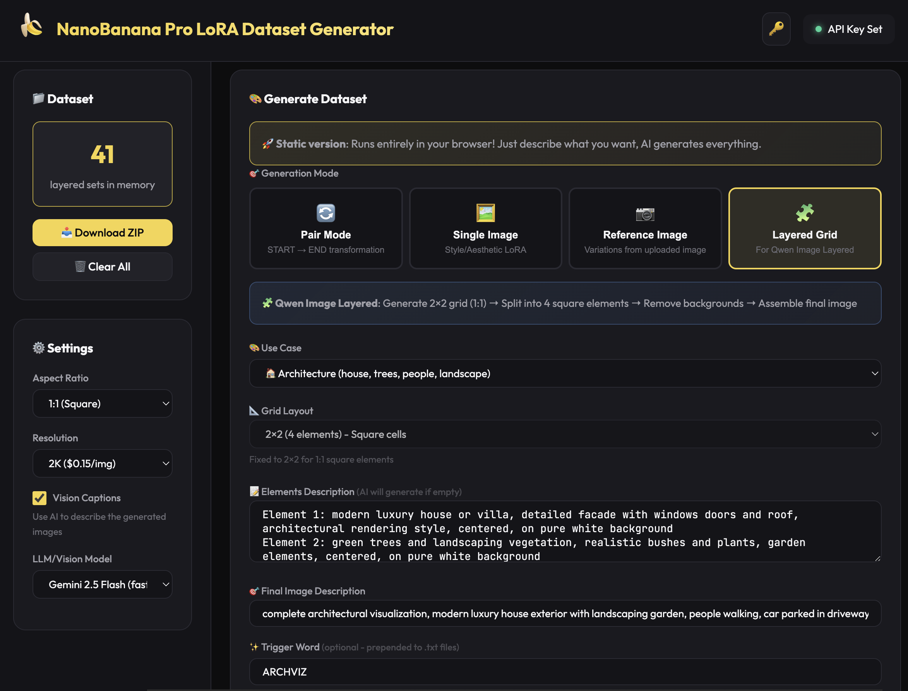

# 🍌 NanoBanana Pro LoRA Dataset Generator

> **Create training datasets for image editing models in minutes!**
> 
> Uses **FAL.ai API** with **Nano Banana Pro** to generate high-quality image pairs for training **Flux 2**, **Z-Image**, **Qwen Image Edit**, and other image-to-image models.



## 🔗 Links

- **🚀 Live Demo**: [lovis.io/NanoBananaLoraDatasetGenerator](https://lovis.io/NanoBananaLoraDatasetGenerator)
- **💻 Source Code**: [github.com/lovisdotio/NanoBananaLoraDatasetGenerator](https://github.com/lovisdotio/NanoBananaLoraDatasetGenerator)

---

## ✨ Features

- **4 Generation Modes**:
  - 🔄 **Pair Mode** - START → END transformation pairs for image editing LoRAs
  - 🖼️ **Single Image** - Style/aesthetic images for Z-Image and style LoRAs
  - 📷 **Reference Image** - Upload a character/product and generate variations
  - 🧩 **Layered Grid** - Generate layered datasets for **Qwen Image Layered** trainer
- **🧠 Custom System Prompt** - Full control over AI prompt generation
- **Zero server setup** - Runs entirely in your browser
- **Direct FAL API calls** - Talks to FAL servers directly
- **Parallel generation** - Generate multiple images simultaneously
- **ZIP download** - Download your complete dataset as a ZIP file
- **Vision captions** - AI-powered image descriptions
- **Trigger word support** - Add custom prefixes to your training data

## 🎯 Generation Modes

### 🔄 Pair Mode (Default)
Generate START → END image pairs for training image editing models.
- Define a transformation (e.g., "zoom out", "add background", "change lighting")
- AI generates creative base prompts + edit instructions
- Perfect for: Flux 2, Qwen Image Edit, instruction-based models

### 🖼️ Single Image Mode
Generate single images with captions for style/aesthetic LoRAs.
- No before/after - just beautiful images with detailed captions
- Perfect for: Z-Image, style transfer, aesthetic LoRAs

### 📷 Reference Image Mode
Upload a reference image and generate variations.
- Upload a character, product, or style reference
- AI creates diverse variations while maintaining consistency
- Perfect for: Character LoRAs, product photography, consistent style training

### 🧩 Layered Grid Mode (NEW!)
Generate datasets for **Qwen Image Layered** trainer.
- Choose a use case (Character, Architecture, Food, Interior, Fashion, Product, or Custom)
- AI generates element prompts for a grid layout (2x2, 2x3, 2x4, or 4x2)
- Generates grid → Splits into elements → Removes backgrounds → Assembles final image
- Outputs in Qwen Layered format: `_start.png` (final) + `_end.png`, `_end2.png`... (layers)
- Perfect for: Qwen Image Layered trainer, depth-based compositing

**Available Presets:**
| Preset | Elements | Grid |
|--------|----------|------|
| 🎮 Character | head, torso, legs, shoes | 2×2 |
| 🏠 Architecture | house, garage, people, trees, sky, cars | 2×3 |
| 🍔 Food | ingredients, garnish, sauce | 2×2 |
| 🛋️ Interior | furniture, decor, plants | 2×2 |
| 👗 Fashion | top, bottom, shoes, accessory | 2×2 |
| 📦 Product | product, packaging, accessory, brand | 2×2 |

**Workflow:**
```
1. Select use case (e.g., Architecture)
2. AI generates element prompts (4 elements)
3. NanoBanana generates 2x2 grid (1:1 aspect ratio)
4. Split grid → Remove backgrounds (via Bria RMBG 2.0)
5. Assemble elements → Final composite image
6. Package: final.png + transparent layers + caption
```

**Architecture Example:**
```
Elements generated:
├── main house or building, modern architecture
├── secondary structure or garage
├── people/characters walking or standing
├── green trees and vegetation
├── sky and clouds
└── cars or vehicles parked

Final image: "complete architectural visualization, modern house 
exterior with landscaping, people, cars, blue sky"
```

## 🚀 Quick Start

### Option 1: Local (Double-click)
Simply open `index.html` in your browser!

> ⚠️ Some browsers block local file API calls. If it doesn't work, use Option 2.

### Option 2: Local Server (Recommended)
```bash
python -m http.server 3000
# Open http://localhost:3000
```

Or with Node.js:
```bash
npx serve .
```

### Option 3: Host Online (Free)
Upload these 3 files to any static hosting:
- **GitHub Pages** - Free, just push to a repo
- **Netlify** - Drag & drop the folder
- **Vercel** - Connect your repo
- **Cloudflare Pages** - Free tier available

## 📁 Files

```
├── index.html    # Main page
├── app.js        # Application logic (calls FAL API directly)
├── style.css     # Styling
└── README.md     # This file
```

## 🔑 API Key

1. Get your free API key at [fal.ai/dashboard/keys](https://fal.ai/dashboard/keys)
2. Click the 🔑 button in the app
3. Enter your key and save

**Security**: Your key is stored ONLY in your browser's localStorage. It's never sent anywhere except directly to FAL's servers.

## 💰 Pricing (FAL)

| Resolution | Cost per image |
|------------|----------------|
| 1K | $0.15 |
| 2K | $0.15 |
| 4K | $0.30 |

Vision captions: ~$0.002 per image

**Examples**:
- Pair Mode: 20 pairs × 2 images × $0.15 = ~$6.00
- Single/Reference Mode: 20 images × $0.15 = ~$3.00

## 🎯 How It Works

```
┌─────────────────────────────────────────────────────────────┐
│                     YOUR BROWSER                            │
│                                                             │
│  1. Choose mode (Pair / Single / Reference)                │
│  2. Enter theme + customization                            │
│  3. AI generates creative prompts (via FAL LLM)            │
│  4. Generate images (via FAL nano-banana-pro)              │
│  5. Optional: Vision captions (via FAL OpenRouter)         │
│  6. Download as ZIP                                         │
│                                                             │
│  ════════════════════════════════════════════════════════   │
│                          │                                  │
│                          ▼                                  │
│                    FAL API SERVERS                          │
│                  (All processing here)                      │
└─────────────────────────────────────────────────────────────┘
```

## 📦 Output Format

### Pair Mode
```
nanobanana_dataset_TIMESTAMP.zip
├── 0001_start.png    # Starting image
├── 0001_end.png      # Transformed image
├── 0001.txt          # Action description / caption
├── 0002_start.png
├── 0002_end.png
├── 0002.txt
└── ...
```

### Single / Reference Mode
```
nanobanana_dataset_TIMESTAMP.zip
├── 0001.png          # Generated image
├── 0001.txt          # Caption
├── 0002.png
├── 0002.txt
└── ...
```

### Layered Grid Mode (Qwen Format)
```
qwen_layered_dataset_TIMESTAMP.zip
├── 0001_start.png    # Final assembled image
├── 0001_end.png      # Layer 1 (transparent)
├── 0001_end2.png     # Layer 2 (transparent)
├── 0001_end3.png     # Layer 3 (transparent)
├── 0001_end4.png     # Layer 4 (transparent)
├── 0001.txt          # Caption
├── 0002_start.png
├── 0002_end.png
└── ...
```

Compatible with:
- **Flux 2** - LoRA fine-tuning
- **Z-Image** - Style/aesthetic training
- **Qwen Image Edit** - Instruction-based editing
- **Qwen Image Layered** - Layered/depth-based training (use Layered Grid mode)
- **SDXL** - Fine-tuning and LoRA
- **Any image-to-image model** - Universal format

## ⚙️ Configuration

| Setting | Description |
|---------|-------------|
| **Mode** | Pair, Single Image, Reference Image, or Layered Grid |
| **Theme** | What kind of images to generate (e.g., "portraits of diverse people") |
| **Transformation** | (Pair mode only) What change to learn |
| **Reference Image** | (Reference mode only) Upload character/product/style image |
| **Use Case** | (Layered mode only) Character, Food, Interior, Fashion, Product, or Custom |
| **Grid Layout** | (Layered mode only) 2x2, 2x3, 2x4, or 4x2 (max 8 layers) |
| **Elements Description** | (Layered mode only) Describe each element or let AI generate |
| **Final Image Description** | (Layered mode only) How elements should be assembled |
| **Custom System Prompt** | Customize how AI generates prompts |
| **Action Name** | Optional - AI generates one if empty |
| **Trigger Word** | Optional - Prepended to all .txt files (e.g., "MYZOOM") |
| **Number of Items** | Max 40 per generation (run multiple times for more) |
| **Parallel** | How many to generate simultaneously (1-10) |
| **Resolution** | 1K, 2K, or 4K |
| **Vision Captions** | Use AI to describe generated images |

## 🔧 Customization

### Custom System Prompt
The system prompt controls how the AI generates creative prompts. Edit it to:
- Focus on specific styles or aesthetics
- Add constraints or rules
- Target specific use cases

Default prompts are optimized for each mode but can be fully customized.

### Change LLM Model
Available in the Settings panel:
- `google/gemini-2.5-flash` (fast, cheap)
- `google/gemini-2.5-pro` (better quality)
- `anthropic/claude-3.5-sonnet` (excellent quality)
- `openai/gpt-4o` (excellent quality)

### Parallel Requests
Default is 3. Increase for faster generation (but may hit rate limits).

## 🐛 Troubleshooting

### "Failed to fetch" errors
- Check your API key is valid
- Check you have credits on FAL
- Try reducing parallel requests to 1

### CORS errors when opening locally
Use a local server instead of double-clicking:
```bash
python -m http.server 3000
```

### Generation is slow
- Increase parallel requests (up to 5-10)
- Use 1K resolution instead of 4K
- Disable vision captions for faster generation

### LLM Parser errors
- Keep number of items ≤ 40 per generation
- Run multiple generations if you need more

## 📜 License

MIT - Use freely for any purpose.

## 🙏 Credits

- **FAL.ai** - GPU infrastructure and models
- **NanoBanana Pro** - Image generation model
- **OpenRouter** - LLM routing for prompts and captions

---

Made with 🍌 for the AI art community
